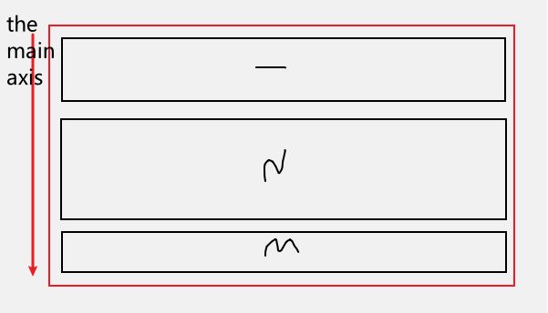

# React Project spotifyjammming

## Project Structure


## Skills 

- React Class Component

- Components Interaction 

- Lifecycle

- Async requests with a 3rd party API(Spotify)

- [Responsive] layout using Flexbox


## Takeaways & Little Tricks

1. The useful combination of **flex-direction** & **align-items**

    Default Flexbox aligns flex items in the horizontal direction, and in this situation, the cross axis will be the vertical direction.

    Sometimes, we want to have flex items in verticall direction and centered.


    > Switch the main axis from the row direction
    ```
    flex-direction: column;
    ```
    However, only changing the **flex-direction** is not enough. We also encounter some problems about the flex items size.

    > flex-direction:row, let's see the difference between **align-items:normal** vs **align-items: center**

    

    Even those 6 flex items have different heights, Flexbox system by default applies the max width of those boxes for all items.

    

    While when we apply align-items:center, those boxes can have different heights, and in the cross axis direction, centered.


    > So same for **flex-direction:column**

    

    In this situation, flex items take up all space in the cross direction

    


   2. CSS transition

        A CSS transition effect can change property values smoothly.

        ```
        //Inside a selector

        div {
            ...
            transition: background-color 0.5s;
        }

        div:hover{
            background-color: a different color;
        }
        ```

        Specify a property you want to change and a duration.

        [More transition knowledge](https://www.w3schools.com/css/css3_transitions.asp)

    3. overflow-y

        > overflow-y: scroll;

        The overflow-y property sets what shows when content overflows a block-level element's top and bottom edges.

        > ::-webkit-scrollbar to create a custom scrollbar

        ```
        ::-webkit-scrollbar{
            width: 10px;
        }

        ::-webkit-scrollbar{
            width: 0px;
            background: transparent;
        }
        ```

    4. Controlled input element

        Use state & onChange

        ```
        ...
        this.setState({value: e.target.value});

        ...
        ```

        Using this combination can have the value of the input and manage it as a state of the component.